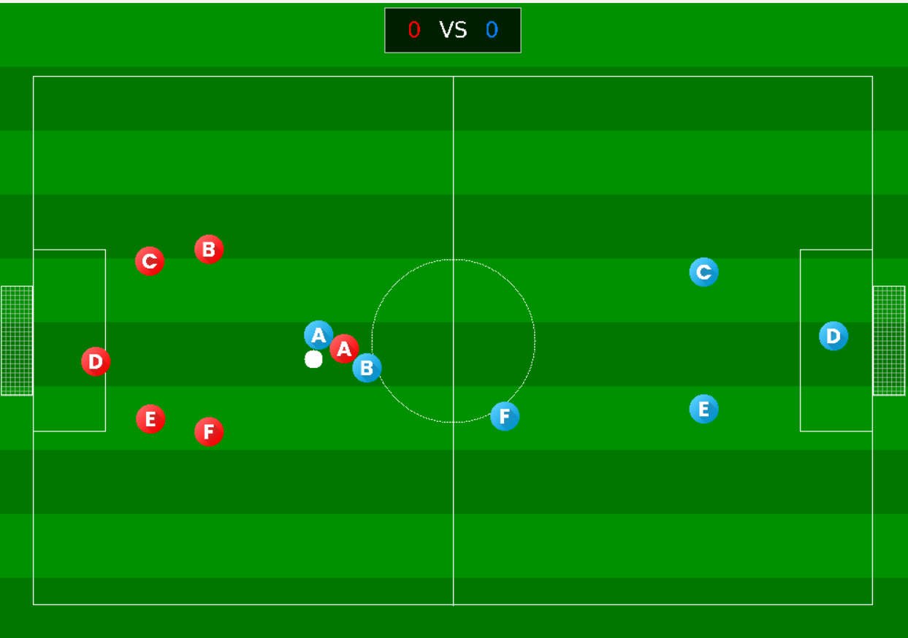
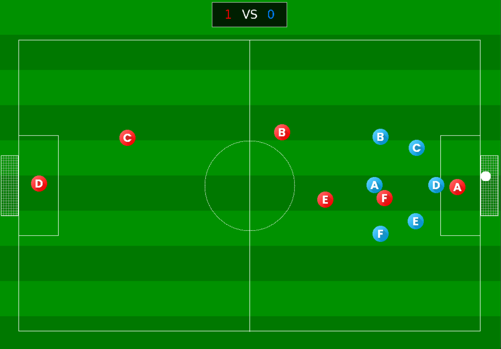

# ⚽ Soccer Engine

A real-time 6v6 soccer simulation built in **C99** with **SDL2**, featuring custom 2D physics, rule enforcement, player state management, and role-based coach AI.

The project combines a lightweight game engine with autonomous player behavior to simulate a complete soccer match between two teams.

---

## 🎮 Overview

Soccer Engine is a real-time 6v6 football simulation where players, the ball, referee rules, and AI systems interact continuously inside an SDL2-based game loop.

Each player operates through a small state machine and receives behavior from the coach system. Players can move, intercept, pass, shoot, defend, and reposition based on their role and the current state of the match.

The referee system independently validates gameplay rules and prevents invalid actions while handling important match events such as goals and out-of-bounds situations.

---

## ✨ Features

### Match Simulation

* 6v6 real-time soccer simulation
* Team scoring and match flow
* Player and ball movement
* Ball possession tracking
* Collision and boundary handling
* Automatic match updates

### 🤖 Player AI

* Role-based player behavior
* Attackers, midfielders, defenders, and goalkeeper positioning
* Dynamic interception
* Intelligent passing decisions
* Goal-directed shooting
* Defensive positioning based on ball and opponent locations
* Automatic player state transitions

### 🧑‍⚖️ Referee System

* Goal detection
* Out-of-bounds detection
* Player talent validation
* Movement and speed restrictions
* Shooting validation
* Ball possession validation
* Kickoff and restart rule enforcement

### 🎨 Rendering

* SDL2-based real-time rendering
* Team-specific player icons
* Soccer field visualization
* Ball and player rendering
* Score display
* Embedded font rendering

---

## 📸 Gameplay





---

## 🧠 Architecture

The project is organized into several independent systems responsible for different aspects of the simulation:

```text
                    ┌─────────────────────┐
                    │       Game Loop     │
                    │       main.c        │
                    └──────────┬──────────┘
                               │
             ┌─────────────────┼─────────────────┐
             │                 │                 │
             ▼                 ▼                 ▼
      ┌─────────────┐   ┌─────────────┐   ┌─────────────┐
      │    Scene    │   │  Referee    │   │   Coach AI  │
      │    Logic    │   │   System    │   │             │
      └──────┬──────┘   └─────────────┘   └──────┬──────┘
             │                                   │
             └────────────────┬──────────────────┘
                              ▼
                    ┌─────────────────────┐
                    │      Entities       │
                    │ Player / Team / Ball│
                    └──────────┬──────────┘
                               │
                               ▼
                    ┌─────────────────────┐
                    │      Renderer       │
                    │        SDL2         │
                    └─────────────────────┘
```

### Core Systems

**Game & Scene**

* Controls the simulation lifecycle
* Updates gameplay state
* Coordinates possession and match events

**Entities**

* `Player`
* `Team`
* `Ball`
* `Field`

**Coach**

* Assigns player roles and behaviors
* Controls movement and shooting decisions
* Provides formations and kickoff positions
* Drives player state transitions

**Referee**

* Validates gameplay actions
* Enforces movement and talent constraints
* Detects goals and boundary events
* Controls rule-sensitive actions such as shooting and kickoffs

**Graphics**

* Handles SDL2 initialization
* Renders the field and game entities
* Displays scores and other game information

---

## 🏃 Player State Machine

Players use a lightweight state machine to represent their current behavior:

```text
                 ┌──────────┐
                 │   IDLE   │
                 └────┬─────┘
                      │
              ┌───────┴────────┐
              ▼                ▼
        ┌──────────┐     ┌──────────────┐
        │  MOVING  │     │ INTERCEPTING │
        └────┬─────┘     └──────┬───────┘
             │                  │
             └────────┬─────────┘
                      ▼
                ┌──────────┐
                │ SHOOTING │
                └──────────┘
```

The coach determines appropriate behavior while the referee validates whether state transitions and actions are legal.

---

## 🛠️ Tech Stack

| Technology         | Purpose                    |
| ------------------ | -------------------------- |
| **C99**            | Core implementation        |
| **SDL2**           | Windowing and rendering    |
| **SDL_image**      | Image and icon handling    |
| **SDL_ttf**        | Text rendering             |
| **CMake**          | Build system               |
| **Custom 2D Math** | Player and ball kinematics |

Dependencies can be provided through the system installation or retrieved through CMake's `FetchContent` mechanism.

---

## 📁 Project Structure

```text
.
├── main.c
├── CMakeLists.txt
├── cmake/
│   └── LinkSDL2.cmake
│
├── assets/
│   └── screenshots/
│       ├── gameplay-1.png
│       └── gameplay-2.png
│
└── engine/
    ├── assets/
    │   ├── fonts/
    │   └── icons/
    │
    ├── core/
    │   ├── constants.h
    │   └── vec2.c / vec2.h
    │
    ├── entities/
    │   ├── ball.h
    │   ├── field.h
    │   ├── player.c / player.h
    │   └── team.c / team.h
    │
    ├── game/
    │   ├── possession.c / possession.h
    │   └── scene.c / scene.h
    │
    ├── graphics/
    │   └── renderer.c / renderer.h
    │
    └── logic/
        ├── coach.c / coach.h
        └── referee.c / referee.h
```

---

## 🚀 Build & Run

### Requirements

* **CMake 3.20+**
* A **C99-compatible compiler**
* `xxd`
* SDL2
* SDL_image
* SDL_ttf

### Build

```bash
git clone https://github.com/maani-safari/FOP-Project.git
cd FOP-Project

mkdir build
cd build

cmake ..
cmake --build .
```

### Run

**Linux / macOS**

```bash
./bin/soccerengine
```

**Windows**

```powershell
.\bin\soccerengine.exe
```

The match starts automatically when the application launches.

---

## 📌 Design Highlights

A few aspects of the project that were particularly important from an implementation perspective:

* **Separation of responsibilities** between simulation, referee rules, AI, entities, and rendering
* **Function-pointer based player behavior** for flexible coach-controlled logic
* **State-driven player actions** instead of hard-coded behavior in the main game loop
* **Independent rule validation** through the referee system
* **Custom vector mathematics** for movement and ball physics
* **Role-aware decision making** for more realistic team behavior

---

## 🎓 Background

This project was originally developed as a **Fundamentals of Programming (FOP)** course project in Fall 2025 and evolved into a complete soccer simulation combining gameplay logic, AI behavior, physics, and real-time rendering.

---

## 👤 Credits

The project builds upon the Soccer Engine framework provided for the FOP course.

Engine / assignment base by:

* [MatinB02](https://github.com/MatinB02)

---

## 📄 License

This project was developed for educational purposes.
